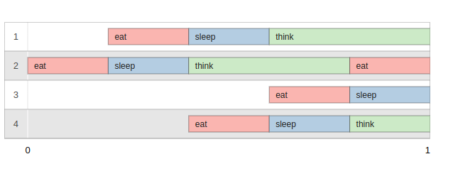
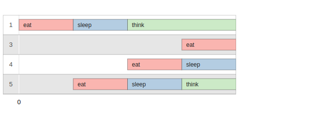
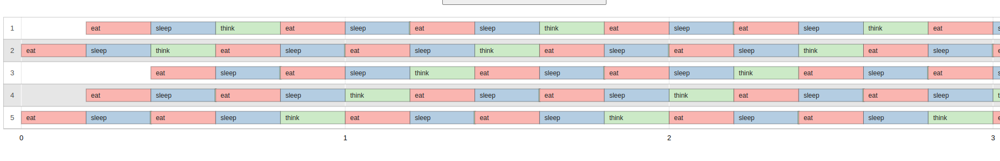
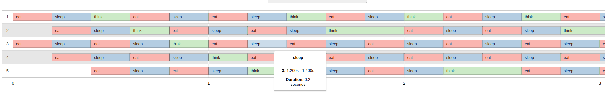

# ./philo 4 800 200 200 - DEAD
### With timer
0 2 has taken a fork - timer 0
0 2 has taken a fork - timer 0
0 2 is eating - timer: 0
200 2 is sleeping - timer: 200
200 1 has taken a fork - timer 200
200 1 has taken a fork - timer 200
200 1 is eating - timer: 200
400 2 is thinking - timer:400
400 1 is sleeping - timer: 200
400 4 has taken a fork - timer 400
400 4 has taken a fork - timer 400
400 4 is eating - timer: 400
600 4 is sleeping - timer: 200
600 3 has taken a fork - timer 600
600 3 has taken a fork - timer 600
600 3 is eating - timer: 600
600 1 is thinking - timer:400
800 3 is sleeping - timer: 200
800 4 is thinking - timer:400
800 2 has taken a fork - timer 800
800 2 has taken a fork - timer 800
800 2 is eating - timer: 800
1000 2 is sleeping - timer: 200
1000 1 died AHHHH - timer: 800

[1] Eat: false | Sleep: false | Think: true  | Death: yes | Last Meal Time: 200ms
    Timer since end of last meal: 0ms

### Without - for visualizer

0 2 has taken a fork
0 2 has taken a fork
0 2 is eating
200 2 is sleeping
200 1 has taken a fork
200 1 has taken a fork
200 1 is eating
400 2 is thinking
400 1 is sleeping
400 4 has taken a fork
400 4 has taken a fork
400 4 is eating
600 4 is sleeping
600 3 has taken a fork
600 3 has taken a fork
600 3 is eating
600 1 is thinking
800 3 is sleeping
800 4 is thinking
800 2 has taken a fork
800 2 has taken a fork
800 2 is eating
1000 2 is sleeping
1000 1 died

# ./philo 5 800 200 200  - DEAD
### With timer
0 1 has taken a fork - timer 0
0 1 has taken a fork - timer 0
0 1 is eating - timer: 0
200 1 is sleeping - timer: 200
200 5 has taken a fork - timer 200
200 5 has taken a fork - timer 200
200 5 is eating - timer: 200
400 1 is thinking - timer:400
400 5 is sleeping - timer: 200
400 4 has taken a fork - timer 400
400 4 has taken a fork - timer 400
400 4 is eating - timer: 400
600 5 is thinking - timer:400
600 4 is sleeping - timer: 200
600 3 has taken a fork - timer 600
600 3 has taken a fork - timer 600
600 3 is eating - timer: 600
800 3 is sleeping - timer: 200
800 2 has taken a fork - timer 800
800 2 has taken a fork - timer 800
800 2 is eating - timer: 800
800 4 is thinking - timer:400
800 1 died AHHHH - timer: 800

Simulation Parameters:
PHILOSOPHERS: 5 | TTD: 800ms | TTE: 200ms | TTS: 200ms | Meal Limit: -1

#### Philosopher Status at End of Simulation:
[1] Eat: false | Sleep: false | Think: true  | Death: yes | Last Meal Time: 0ms
    Timer since end of last meal: 0ms
[2] Eat: true  | Sleep: false | Think: false | Death: no  | Last Meal Time: 800ms
    Timer since end of last meal: 0ms
[3] Eat: false | Sleep: true  | Think: false | Death: no  | Last Meal Time: 600ms
    Timer since end of last meal: 0ms
[4] Eat: false | Sleep: false | Think: true  | Death: no  | Last Meal Time: 400ms
    Timer since end of last meal: 0ms
[5] Eat: false | Sleep: false | Think: true  | Death: no  | Last Meal Time: 200ms
    Timer since end of last meal: 0ms

### Without - for visualizer

0 1 has taken a fork
0 1 has taken a fork
0 1 is eating
200 1 is sleeping
200 5 has taken a fork
200 5 has taken a fork
200 5 is eating
400 1 is thinking
400 5 is sleeping
400 4 has taken a fork
400 4 has taken a fork
400 4 is eating
600 5 is thinking
600 4 is sleeping
600 3 has taken a fork
600 3 has taken a fork
600 3 is eating
800 3 is sleeping
800 2 has taken a fork
800 2 has taken a fork
800 2 is eating
800 4 is thinking
800 1 died

### WHEN THEY DON'T DIE - WITH TIMER
0 5 has taken a fork - timer 0
0 5 has taken a fork - timer 0
0 5 is eating - timer: 0
0 2 has taken a fork - timer 0
0 2 has taken a fork - timer 0
0 2 is eating - timer: 0
200 2 is sleeping - timer: 200
200 5 is sleeping - timer: 200
200 4 has taken a fork - timer 200
200 4 has taken a fork - timer 200
200 4 is eating - timer: 200
200 1 has taken a fork - timer 200
200 1 has taken a fork - timer 200
200 1 is eating - timer: 200
400 2 is thinking - timer:400
400 1 is sleeping - timer: 200
400 5 is thinking - timer:400
400 4 is sleeping - timer: 200
400 3 has taken a fork - timer 400
400 3 has taken a fork - timer 400
400 3 is eating - timer: 400
400 5 has taken a fork - timer 400
400 5 has taken a fork - timer 400
400 5 is eating - timer: 400
600 3 is sleeping - timer: 200
600 5 is sleeping - timer: 200
600 2 has taken a fork - timer 600
600 2 has taken a fork - timer 600
600 2 is eating - timer: 600
600 1 is thinking - timer:400
600 4 is thinking - timer:400
600 4 has taken a fork - timer 400
600 4 has taken a fork - timer 400
600 4 is eating - timer: 400
800 4 is sleeping - timer: 200
800 3 is thinking - timer:400
800 5 is thinking - timer:400
800 2 is sleeping - timer: 200
800 3 has taken a fork - timer 400
800 3 has taken a fork - timer 400
800 3 is eating - timer: 400
800 1 has taken a fork - timer 600
800 1 has taken a fork - timer 600
800 1 is eating - timer: 600
1000 3 is sleeping - timer: 200
1000 1 is sleeping - timer: 200
1000 5 has taken a fork - timer 600
1000 5 has taken a fork - timer 600
1000 5 is eating - timer: 600
1000 4 is thinking - timer:400
1000 2 is thinking - timer:400
1000 2 has taken a fork - timer 400
1000 2 has taken a fork - timer 400
1000 2 is eating - timer: 400
1200 3 is thinking - timer:400
1200 1 is thinking - timer:400
1200 5 is sleeping - timer: 200
1200 4 has taken a fork - timer 600
1200 4 has taken a fork - timer 600
1200 4 is eating - timer: 600
1200 2 is sleeping - timer: 200
1200 1 has taken a fork - timer 400
1200 1 has taken a fork - timer 400
1200 1 is eating - timer: 400
1400 5 is thinking - timer:400
1400 1 is sleeping - timer: 200
1400 2 is thinking - timer:400
1400 4 is sleeping - timer: 200
1400 5 has taken a fork - timer 400
1400 5 has taken a fork - timer 400
1400 5 is eating - timer: 400
1400 3 has taken a fork - timer 600
1400 3 has taken a fork - timer 600
1400 3 is eating - timer: 600
1600 4 is thinking - timer:400
1600 5 is sleeping - timer: 200
1600 3 is sleeping - timer: 200
1600 2 has taken a fork - timer 600
1600 2 has taken a fork - timer 600
1600 2 is eating - timer: 600
1600 4 has taken a fork - timer 400
1600 4 has taken a fork - timer 400
1600 4 is eating - timer: 400
1600 1 is thinking - timer:400
1800 5 is thinking - timer:400
1800 4 is sleeping - timer: 200
1800 2 is sleeping - timer: 200
1800 1 has taken a fork - timer 600
1800 1 has taken a fork - timer 600
1800 1 is eating - timer: 600
1800 3 is thinking - timer:400
1800 3 has taken a fork - timer 400
1800 3 has taken a fork - timer 400
1800 3 is eating - timer: 400
2000 3 is sleeping - timer: 200
2000 2 is thinking - timer:400
2000 1 is sleeping - timer: 200
2000 5 has taken a fork - timer 600
2000 5 has taken a fork - timer 600
2000 5 is eating - timer: 600
2000 4 is thinking - timer:400
2000 2 has taken a fork - timer 400
2000 2 has taken a fork - timer 400
2000 2 is eating - timer: 400
2200 3 is thinking - timer:400
2200 5 is sleeping - timer: 200
2200 2 is sleeping - timer: 200
2200 4 has taken a fork - timer 600
2200 4 has taken a fork - timer 600
2200 4 is eating - timer: 600
2200 1 is thinking - timer:400
2200 1 has taken a fork - timer 400
2200 1 has taken a fork - timer 400
2200 1 is eating - timer: 400
2400 5 is thinking - timer:400
2400 4 is sleeping - timer: 200
2400 3 has taken a fork - timer 600
2400 3 has taken a fork - timer 600
2400 3 is eating - timer: 600
2400 1 is sleeping - timer: 200
2400 5 has taken a fork - timer 400
2400 5 has taken a fork - timer 400
2400 5 is eating - timer: 400
2400 2 is thinking - timer:400
2600 5 is sleeping - timer: 200
2600 1 is thinking - timer:400
2600 4 is thinking - timer:400
2600 3 is sleeping - timer: 200
2600 4 has taken a fork - timer 400
2600 4 has taken a fork - timer 400
2600 4 is eating - timer: 400
2600 2 has taken a fork - timer 600
2600 2 has taken a fork - timer 600
2600 2 is eating - timer: 600
2800 4 is sleeping - timer: 200
2800 3 is thinking - timer:400
2800 5 is thinking - timer:400
2800 2 is sleeping - timer: 200
2800 3 has taken a fork - timer 400
2800 3 has taken a fork - timer 400
2800 3 is eating - timer: 400
2800 1 has taken a fork - timer 600
2800 1 has taken a fork - timer 600
2800 1 is eating - timer: 600
3000 3 is sleeping - timer: 200
3000 4 is thinking - timer:400
3000 2 is thinking - timer:400
3000 1 is sleeping - timer: 200
3000 2 has taken a fork - timer 400
3000 2 has taken a fork - timer 400
3000 2 is eating - timer: 400
3000 5 has taken a fork - timer 600
3000 5 has taken a fork - timer 600
3000 5 is eating - timer: 600
3200 1 is thinking - timer:400
3200 5 is sleeping - timer: 200
3200 4 has taken a fork - timer 600
3200 4 has taken a fork - timer 600
3200 4 is eating - timer: 600
3200 2 is sleeping - timer: 200
3200 1 has taken a fork - timer 400
3200 1 has taken a fork - timer 400
3200 1 is eating - timer: 400
3200 3 is thinking - timer:400
3400 5 is thinking - timer:400
3400 1 is sleeping - timer: 200
3400 4 is sleeping - timer: 200
3400 5 has taken a fork - timer 400
3400 5 has taken a fork - timer 400
3400 5 is eating - timer: 400
3400 3 has taken a fork - timer 600
3400 3 has taken a fork - timer 600
3400 3 is eating - timer: 600
3400 2 is thinking - timer:400
3600 5 is sleeping - timer: 200
3600 3 is sleeping - timer: 200
3600 2 has taken a fork - timer 600
3600 2 has taken a fork - timer 600
3600 2 is eating - timer: 600
3600 4 is thinking - timer:400
3600 4 has taken a fork - timer 400
3600 4 has taken a fork - timer 400
3600 4 is eating - timer: 400
3600 1 is thinking - timer:400
3800 5 is thinking - timer:400
3800 3 is thinking - timer:400
3800 4 is sleeping - timer: 200
3800 2 is sleeping - timer: 200
3800 3 has taken a fork - timer 400
3800 3 has taken a fork - timer 400
3800 3 is eating - timer: 400
3800 1 has taken a fork - timer 600
3800 1 has taken a fork - timer 600
3800 1 is eating - timer: 600
4000 4 is thinking - timer:400
4000 3 is sleeping - timer: 200
4000 2 is thinking - timer:400
4000 1 is sleeping - timer: 200
4000 5 has taken a fork - timer 600
4000 5 has taken a fork - timer 600
4000 5 is eating - timer: 600
4000 2 has taken a fork - timer 400
4000 2 has taken a fork - timer 400
4000 2 is eating - timer: 400

### WHEN THEY DON'T DIE - FOR VISUALIZER

jslusark@c3a10c2 ~/4/g/philos (main)> ./philo 5 800 200 200
0 5 has taken a fork
0 5 has taken a fork
0 5 is eating
0 2 has taken a fork
0 2 has taken a fork
0 2 is eating
200 2 is sleeping
200 5 is sleeping
200 4 has taken a fork
200 4 has taken a fork
200 4 is eating
200 1 has taken a fork
200 1 has taken a fork
200 1 is eating
400 2 is thinking
400 1 is sleeping
400 5 is thinking
400 4 is sleeping
400 3 has taken a fork
400 3 has taken a fork
400 3 is eating
400 5 has taken a fork
400 5 has taken a fork
400 5 is eating
600 3 is sleeping
600 5 is sleeping
600 2 has taken a fork
600 2 has taken a fork
600 2 is eating
600 1 is thinking
600 4 is thinking
600 4 has taken a fork
600 4 has taken a fork
600 4 is eating
800 4 is sleeping
800 3 is thinking
800 5 is thinking
800 2 is sleeping
800 3 has taken a fork
800 3 has taken a fork
800 3 is eating
800 1 has taken a fork
800 1 has taken a fork
800 1 is eating
1000 3 is sleeping
1000 1 is sleeping
1000 5 has taken a fork
1000 5 has taken a fork
1000 5 is eating
1000 4 is thinking
1000 2 is thinking
1000 2 has taken a fork
1000 2 has taken a fork
1000 2 is eating
1200 3 is thinking
1200 1 is thinking
1200 5 is sleeping
1200 4 has taken a fork
1200 4 has taken a fork
1200 4 is eating
1200 2 is sleeping
1200 1 has taken a fork
1200 1 has taken a fork
1200 1 is eating
1400 5 is thinking
1400 1 is sleeping
1400 2 is thinking
1400 4 is sleeping
1400 5 has taken a fork
1400 5 has taken a fork
1400 5 is eating
1400 3 has taken a fork
1400 3 has taken a fork
1400 3 is eating
1600 4 is thinking
1600 5 is sleeping
1600 3 is sleeping
1600 2 has taken a fork
1600 2 has taken a fork
1600 2 is eating
1600 4 has taken a fork
1600 4 has taken a fork
1600 4 is eating
1600 1 is thinking
1800 5 is thinking
1800 4 is sleeping
1800 2 is sleeping
1800 1 has taken a fork
1800 1 has taken a fork
1800 1 is eating
1800 3 is thinking
1800 3 has taken a fork
1800 3 has taken a fork
1800 3 is eating
2000 3 is sleeping
2000 2 is thinking
2000 1 is sleeping
2000 5 has taken a fork
2000 5 has taken a fork
2000 5 is eating
2000 4 is thinking
2000 2 has taken a fork
2000 2 has taken a fork
2000 2 is eating
2200 3 is thinking
2200 5 is sleeping
2200 2 is sleeping
2200 4 has taken a fork
2200 4 has taken a fork
2200 4 is eating
2200 1 is thinking
2200 1 has taken a fork
2200 1 has taken a fork
2200 1 is eating
2400 5 is thinking
2400 4 is sleeping
2400 3 has taken a fork
2400 3 has taken a fork
2400 3 is eating
2400 1 is sleeping
2400 5 has taken a fork
2400 5 has taken a fork
2400 5 is eating
2400 2 is thinking
2600 5 is sleeping
2600 1 is thinking
2600 4 is thinking
2600 3 is sleeping
2600 4 has taken a fork
2600 4 has taken a fork
2600 4 is eating
2600 2 has taken a fork
2600 2 has taken a fork
2600 2 is eating
2800 4 is sleeping
2800 3 is thinking
2800 5 is thinking
2800 2 is sleeping
2800 3 has taken a fork
2800 3 has taken a fork
2800 3 is eating
2800 1 has taken a fork
2800 1 has taken a fork
2800 1 is eating
3000 3 is sleeping
3000 4 is thinking
3000 2 is thinking
3000 1 is sleeping
3000 2 has taken a fork
3000 2 has taken a fork
3000 2 is eating
3000 5 has taken a fork
3000 5 has taken a fork
3000 5 is eating
3200 1 is thinking
3200 5 is sleeping
3200 4 has taken a fork
3200 4 has taken a fork
3200 4 is eating
3200 2 is sleeping
3200 1 has taken a fork
3200 1 has taken a fork
3200 1 is eating
3200 3 is thinking
3400 5 is thinking
3400 1 is sleeping
3400 4 is sleeping
3400 5 has taken a fork
3400 5 has taken a fork
3400 5 is eating
3400 3 has taken a fork
3400 3 has taken a fork
3400 3 is eating
3400 2 is thinking
3600 5 is sleeping
3600 3 is sleeping
3600 2 has taken a fork
3600 2 has taken a fork
3600 2 is eating
3600 4 is thinking
3600 4 has taken a fork
3600 4 has taken a fork
3600 4 is eating
3600 1 is thinking
3800 5 is thinking
3800 3 is thinking
3800 4 is sleeping
3800 2 is sleeping
3800 3 has taken a fork
3800 3 has taken a fork
3800 3 is eating
3800 1 has taken a fork
3800 1 has taken a fork
3800 1 is eating
4000 4 is thinking
4000 3 is sleeping
4000 2 is thinking
4000 1 is sleeping
4000 5 has taken a fork
4000 5 has taken a fork
4000 5 is eating
4000 2 has taken a fork
4000 2 has taken a fork
4000 2 is eating

### NEW
0 1 has taken a fork - timer 0
0 1 has taken a fork - timer 0
0 1 is eating - timer: 0
0 3 has taken a fork - timer 0
0 3 has taken a fork - timer 0
0 3 is eating - timer: 0
200 3 is sleeping - timer: 200
200 4 has taken a fork - timer 200
200 4 has taken a fork - timer 200
200 4 is eating - timer: 200
200 1 is sleeping - timer: 200
200 2 has taken a fork - timer 200
200 2 has taken a fork - timer 200
200 2 is eating - timer: 200
400 3 is thinking - timer:400
400 2 is sleeping - timer: 200
400 1 is thinking - timer:400
400 4 is sleeping - timer: 200
400 3 has taken a fork - timer 400
400 3 has taken a fork - timer 400
400 3 is eating - timer: 400
400 5 has taken a fork - timer 400
400 5 has taken a fork - timer 400
400 5 is eating - timer: 400
600 5 is sleeping - timer: 200
600 3 is sleeping - timer: 200
600 1 has taken a fork - timer 600
600 1 has taken a fork - timer 600
600 1 is eating - timer: 600
600 2 is thinking - timer:400
600 4 is thinking - timer:400
600 4 has taken a fork - timer 400
600 4 has taken a fork - timer 400
600 4 is eating - timer: 400
800 1 is sleeping - timer: 200
800 2 has taken a fork - timer 600
800 2 has taken a fork - timer 600
800 2 is eating - timer: 600
800 4 is sleeping - timer: 200
800 5 is thinking - timer:400
800 5 has taken a fork - timer 400
800 5 has taken a fork - timer 400
800 5 is eating - timer: 400
800 3 is thinking - timer:400
1000 1 is thinking - timer:400
1000 4 is thinking - timer:400
1000 2 is sleeping - timer: 200
1000 3 has taken a fork - timer 600
1000 3 has taken a fork - timer 600
1000 3 is eating - timer: 600
1000 5 is sleeping - timer: 200
1000 1 has taken a fork - timer 400
1000 1 has taken a fork - timer 400
1000 1 is eating - timer: 400
1200 3 is sleeping - timer: 200
1200 1 is sleeping - timer: 200
1200 4 has taken a fork - timer 600
1200 4 has taken a fork - timer 600
1200 4 is eating - timer: 600
1200 5 is thinking - timer:400
1200 2 is thinking - timer:400
1200 2 has taken a fork - timer 400
1200 2 has taken a fork - timer 400
1200 2 is eating - timer: 400
1400 2 is sleeping - timer: 200
1400 4 is sleeping - timer: 200
1400 5 has taken a fork - timer 600
1400 5 has taken a fork - timer 600
1400 5 is eating - timer: 600
1400 3 is thinking - timer:400
1400 3 has taken a fork - timer 400
1400 3 has taken a fork - timer 400
1400 3 is eating - timer: 400
1400 1 is thinking - timer:400
1600 3 is sleeping - timer: 200
1600 4 is thinking - timer:400
1600 2 is thinking - timer:400
1600 5 is sleeping - timer: 200
1600 4 has taken a fork - timer 400
1600 4 has taken a fork - timer 400
1600 4 is eating - timer: 400
1600 1 has taken a fork - timer 600
1600 1 has taken a fork - timer 600
1600 1 is eating - timer: 600
1800 3 is thinking - timer:400
1800 5 is thinking - timer:400
1800 4 is sleeping - timer: 200
1800 3 has taken a fork - timer 400
1800 3 has taken a fork - timer 400
1800 3 is eating - timer: 400
1800 1 is sleeping - timer: 200
1800 5 has taken a fork - timer 400
1800 5 has taken a fork - timer 400
1800 5 is eating - timer: 400
2000 3 is sleeping - timer: 200
2000 2 has taken a fork - timer 800
2000 2 has taken a fork - timer 800
2000 2 is eating - timer: 800
2000 5 is sleeping - timer: 200
2000 4 is thinking - timer:400
2000 4 has taken a fork - timer 400
2000 4 has taken a fork - timer 400
2000 4 is eating - timer: 400
2000 1 is thinking - timer:400
2200 2 is sleeping - timer: 200
2200 1 has taken a fork - timer 600
2200 1 has taken a fork - timer 600
2200 1 is eating - timer: 600
2200 5 is thinking - timer:400
2200 4 is sleeping - timer: 200
2200 3 is thinking - timer:400
2200 3 has taken a fork - timer 400
2200 3 has taken a fork - timer 400
2200 3 is eating - timer: 400
2400 2 is thinking - timer:400
2400 4 is thinking - timer:400
2400 3 is sleeping - timer: 200
2400 1 is sleeping - timer: 200
2400 4 has taken a fork - timer 400
2400 4 has taken a fork - timer 400
2400 4 is eating - timer: 400
2400 2 has taken a fork - timer 400
2400 2 has taken a fork - timer 400
2400 2 is eating - timer: 400
2600 1 is thinking - timer:400
2600 3 is thinking - timer:400
2600 2 is sleeping - timer: 200
2600 4 is sleeping - timer: 200
2600 3 has taken a fork - timer 400
2600 3 has taken a fork - timer 400
2600 3 is eating - timer: 400
2600 5 has taken a fork - timer 800
2600 5 has taken a fork - timer 800
2600 5 is eating - timer: 800
2800 5 is sleeping - timer: 200
2800 3 is sleeping - timer: 200
2800 2 is thinking - timer:400
2800 1 has taken a fork - timer 600
2800 1 has taken a fork - timer 600
2800 1 is eating - timer: 600
2800 4 is thinking - timer:400
2800 4 has taken a fork - timer 400
2800 4 has taken a fork - timer 400
2800 4 is eating - timer: 400
3000 5 is thinking - timer:400
3000 3 is thinking - timer:400
3000 4 is sleeping - timer: 200
3000 3 has taken a fork - timer 400
3000 3 has taken a fork - timer 400
3000 3 is eating - timer: 400
3000 1 is sleeping - timer: 200
3000 5 has taken a fork - timer 400
3000 5 has taken a fork - timer 400
3000 5 is eating - timer: 400
3200 1 is thinking - timer:400
3200 3 is sleeping - timer: 200
3200 5 is sleeping - timer: 200
3200 2 has taken a fork - timer 800
3200 2 has taken a fork - timer 800
3200 2 is eating - timer: 800
3200 4 is thinking - timer:400
3200 4 has taken a fork - timer 400
3200 4 has taken a fork - timer 400
3200 4 is eating - timer: 400
3400 5 is thinking - timer:400
3400 3 is thinking - timer:400
3400 2 is sleeping - timer: 200
3400 4 is sleeping - timer: 200
3400 5 has taken a fork - timer 400
3400 5 has taken a fork - timer 400
3400 5 is eating - timer: 400
3400 3 has taken a fork - timer 400
3400 3 has taken a fork - timer 400
3400 3 is eating - timer: 400
3600 2 is thinking - timer:400
3600 5 is sleeping - timer: 200
3600 3 is sleeping - timer: 200
3600 1 died AHHHH - timer: 800

### NEW - VISUALIZER  --- they die because thinking time changes all of a sudden

0 1 has taken a fork
0 1 has taken a fork
0 1 is eating
0 3 has taken a fork
0 3 has taken a fork
0 3 is eating
200 3 is sleeping
200 4 has taken a fork
200 4 has taken a fork
200 4 is eating
200 1 is sleeping
200 2 has taken a fork
200 2 has taken a fork
200 2 is eating
400 3 is thinking
400 2 is sleeping
400 1 is thinking
400 4 is sleeping
400 3 has taken a fork
400 3 has taken a fork
400 3 is eating
400 5 has taken a fork
400 5 has taken a fork
400 5 is eating
600 5 is sleeping
600 3 is sleeping
600 1 has taken a fork
600 1 has taken a fork
600 1 is eating
600 2 is thinking
600 4 is thinking
600 4 has taken a fork
600 4 has taken a fork
600 4 is eating
800 1 is sleeping
800 2 has taken a fork
800 2 has taken a fork
800 2 is eating
800 4 is sleeping
800 5 is thinking
800 5 has taken a fork
800 5 has taken a fork
800 5 is eating
800 3 is thinking
1000 1 is thinking
1000 4 is thinking
1000 2 is sleeping
1000 3 has taken a fork
1000 3 has taken a fork
1000 3 is eating
1000 5 is sleeping
1000 1 has taken a fork
1000 1 has taken a fork
1000 1 is eating
1200 3 is sleeping
1200 1 is sleeping
1200 4 has taken a fork
1200 4 has taken a fork
1200 4 is eating
1200 5 is thinking
1200 2 is thinking
1200 2 has taken a fork
1200 2 has taken a fork
1200 2 is eating
1400 2 is sleeping
1400 4 is sleeping
1400 5 has taken a fork
1400 5 has taken a fork
1400 5 is eating
1400 3 is thinking
1400 3 has taken a fork
1400 3 has taken a fork
1400 3 is eating
1400 1 is thinking
1600 3 is sleeping
1600 4 is thinking
1600 2 is thinking
1600 5 is sleeping
1600 4 has taken a fork
1600 4 has taken a fork
1600 4 is eating
1600 1 has taken a fork
1600 1 has taken a fork
1600 1 is eating
1800 3 is thinking
1800 5 is thinking
1800 4 is sleeping
1800 3 has taken a fork
1800 3 has taken a fork
1800 3 is eating
1800 1 is sleeping
1800 5 has taken a fork
1800 5 has taken a fork
1800 5 is eating
2000 3 is sleeping
2000 2 has taken a fork
2000 2 has taken a fork
2000 2 is eating
2000 5 is sleeping
2000 4 is thinking
2000 4 has taken a fork
2000 4 has taken a fork
2000 4 is eating
2000 1 is thinking
2200 2 is sleeping
2200 1 has taken a fork
2200 1 has taken a fork
2200 1 is eating
2200 5 is thinking
2200 4 is sleeping
2200 3 is thinking
2200 3 has taken a fork
2200 3 has taken a fork
2200 3 is eating
2400 2 is thinking
2400 4 is thinking
2400 3 is sleeping
2400 1 is sleeping
2400 4 has taken a fork
2400 4 has taken a fork
2400 4 is eating
2400 2 has taken a fork
2400 2 has taken a fork
2400 2 is eating
2600 1 is thinking
2600 3 is thinking
2600 2 is sleeping
2600 4 is sleeping
2600 3 has taken a fork
2600 3 has taken a fork
2600 3 is eating
2600 5 has taken a fork
2600 5 has taken a fork
2600 5 is eating
2800 5 is sleeping
2800 3 is sleeping
2800 2 is thinking
2800 1 has taken a fork
2800 1 has taken a fork
2800 1 is eating
2800 4 is thinking
2800 4 has taken a fork
2800 4 has taken a fork
2800 4 is eating
3000 5 is thinking
3000 3 is thinking
3000 4 is sleeping
3000 3 has taken a fork
3000 3 has taken a fork
3000 3 is eating
3000 1 is sleeping
3000 5 has taken a fork
3000 5 has taken a fork
3000 5 is eating
3200 1 is thinking
3200 3 is sleeping
3200 5 is sleeping
3200 2 has taken a fork
3200 2 has taken a fork
3200 2 is eating
3200 4 is thinking
3200 4 has taken a fork
3200 4 has taken a fork
3200 4 is eating
3400 5 is thinking
3400 3 is thinking
3400 2 is sleeping
3400 4 is sleeping
3400 5 has taken a fork
3400 5 has taken a fork
3400 5 is eating
3400 3 has taken a fork
3400 3 has taken a fork
3400 3 is eating
3600 2 is thinking
3600 5 is sleeping
3600 3 is sleeping
3600 1 died
